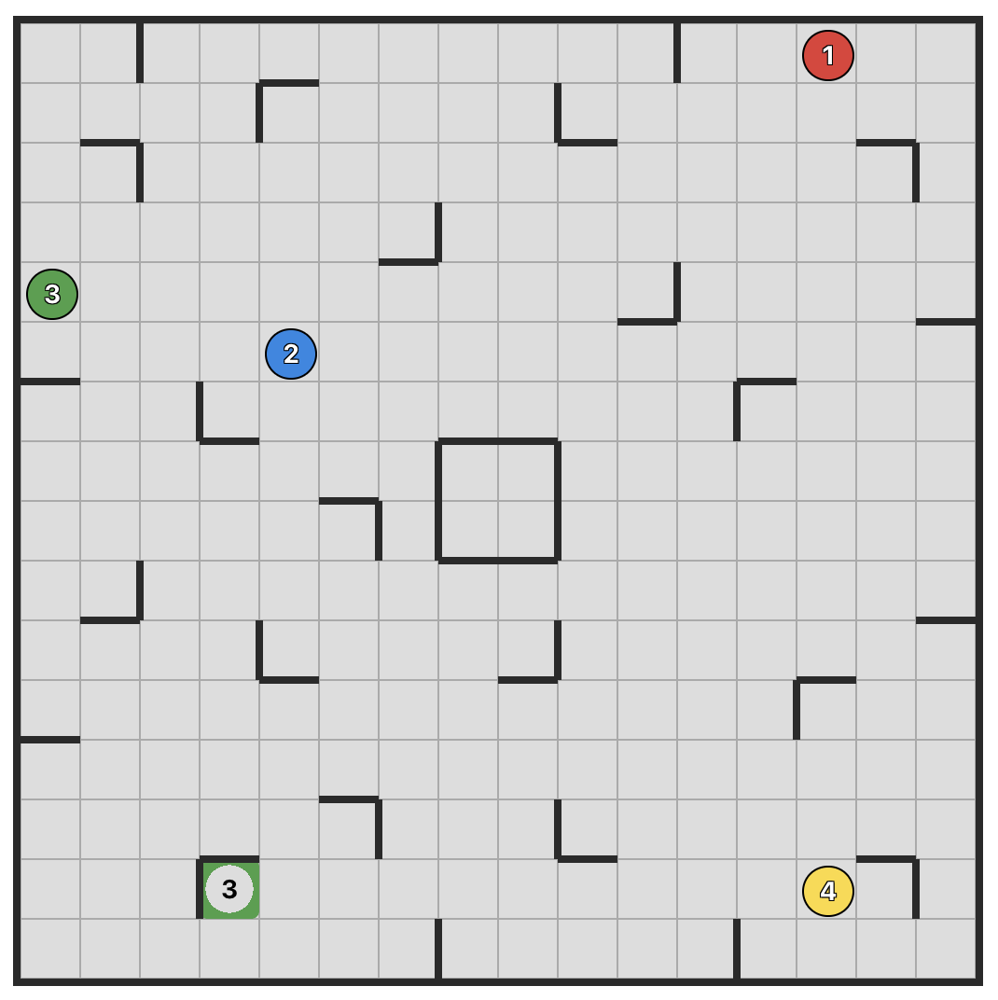

# BounceBot

BounceBot is a real-time, multiplayer web implementation of the board game **Ricochet Robots**.

Players compete in a shared room to find the shortest sequence of moves to guide a designated robot to its target. The catch? Robots only stop when they hit a wall or another robot.

While players calculate their moves, a server-side **A\* solver** runs in the background to establish a "gold standard" for the puzzle's difficulty and provide hints.



## Prerequisites

### Backend & Tooling
*   **Go (v1.24+)**: The core language for the backend server and solver logic.
*   **Protocol Buffers (`protoc`)**: The compiler used to generate type-safe code from `.proto` definitions.
*   **Go Protobuf Plugins**: Required for the server to handle gRPC and Connect-RPC traffic:
    ```bash
    go install google.golang.org/protobuf/cmd/protoc-gen-go@latest
    go install google.golang.org/grpc/cmd/protoc-gen-go-grpc@latest
    go install connectrpc.com/connect/cmd/protoc-gen-connect-go@latest
    ```

### Frontend
*   **Node.js (v18+) & npm**: Required to build the Vue application and manage dependencies.

## Getting Started

### 1. Run the Backend Server

```bash
# From the root directory
go run ./server
```
*The server defaults to port `8080`.*

### 2. Run the Frontend Client

```bash
cd client/web
npm install
npm run dev
```
*The client will start at `http://localhost:5173`.*

### 3. Docker (Recommended for Deployment)

```sh
docker compose up
```
- Client: http://localhost (port 80)
- Server: http://localhost:8080

## Documentation

*   **[docs/architecture.md](docs/architecture.md)**: System architecture overview, game model, communication channels, solver and daily challenge systems.
*   **[docs/server.md](docs/server.md)**: Server deep dive (room orchestration, signal system, WebSocket hub, configuration).
*   **[docs/client.md](docs/client.md)**: Client deep dive (views, composables, stores, services, animation).
*   **[docs/development.md](docs/development.md)**: Development setup, testing, Docker deployment, environment variables, feature flags.
*   **[docs/BASE_PATH_SETUP.md](docs/BASE_PATH_SETUP.md)**: Serving the client under a URL subpath.
