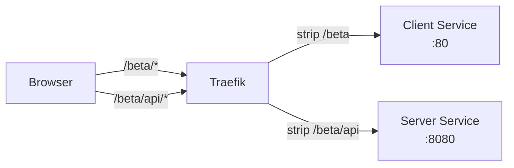

# Serving the Client Under a Subpath (BASE_PATH)

This documents how to deploy the BounceBot client under a URL subpath like `/beta/` so that a reverse proxy can route to it alongside other services or versions.

## Quick Start

Set two environment variables on the client container:

```
BASE_PATH=/beta/
API_BASE_URL=/beta/api
```

The trailing slash on `BASE_PATH` is required. Without it, paths like `/betafavicon_light.svg` will be generated instead of `/beta/favicon_light.svg`.

## To Turn It Off

Remove or unset `BASE_PATH` (or set it to `/`). Remove or unset `API_BASE_URL` (or set it to `/api`). No rebuild needed since everything is runtime.

## What These Variables Do

### BASE_PATH

Controls where the client expects to be served from. Affects:

1. **Vue Router base** - So client-side navigation uses `/beta/`, `/beta/room/ABCD`, etc. instead of `/`, `/room/ABCD`
2. **Asset paths in index.html** - `href="/favicon_light.svg"` becomes `href="/beta/favicon_light.svg"`
3. **Asset paths in JS bundles** - Image references like `"/gear.svg"` become `"/beta/gear.svg"`
4. **Asset paths in CSS bundles** - Font and background URLs like `url(/fonts/...)` become `url(/beta/fonts/...)`
5. **manifest.json** - `start_url` and icon paths are rewritten

### API_BASE_URL

Controls where the client sends RPC and WebSocket requests. The client derives both `httpBaseUrl` and `wsUrl` from this value:

- `API_BASE_URL=/beta/api` produces:
  - HTTP: `https://yourhost.com/beta/api` (Connect RPC calls)
  - WebSocket: `wss://yourhost.com/beta/api/ws`

## How It Works (Runtime Rewriting)

All path rewriting happens at container startup in `client/web/docker-entrypoint.sh`, not at build time. This means a single Docker image can serve under any path.

The entrypoint does two things:

1. **Generates `config.js`** with `API_BASE_URL` and `BASE_PATH` values, which the Vue app reads at startup for router configuration and API endpoints

2. **Rewrites built assets with sed** when `BASE_PATH` is not `/`:
   - `index.html`: all `href="/..."` and `src="/..."` attributes
   - `assets/*.js`: hardcoded SVG image paths (favicon, gear, timer, logo, name)
   - `assets/*.css`: `url(/fonts/...)` and `url(/pattern_...)` references
   - `manifest.json`: `start_url` and icon `src` paths

## BounceBot App Files Involved

| File | Role |
|------|------|
| `client/web/docker-entrypoint.sh` | Runtime sed rewriting + config.js generation |
| `client/web/src/config.ts` | Reads `window.APP_CONFIG`, exports `config.basePath`, `config.httpBaseUrl`, `config.wsUrl` |
| `client/web/src/router.ts` | Passes `config.basePath` to `createWebHistory()` |
| `client/web/public/config.js` | Local dev config (not used in Docker) |

## K8s Deployment (homelab-v1)

The production deployment lives in `apps/base/bouncebot/` and uses Kustomize. The beta deployment in `apps/avalon/bouncebot-beta/` overlays the base with patches.

### Base deployment (`apps/base/bouncebot/`)

The base deployment serves at the root path (`/`):

- **`client.yaml`** - Client deployment with `API_BASE_URL=/api` env var, plus a ClusterIP service on port 80
- **`server.yaml`** - Server deployment with `ALLOWED_ORIGINS`, `DATA_FILE`, `PUBLIC_CLIENT_URL`, `PUBLIC_SERVER_URL` env vars, a PVC volume mount, and a ClusterIP service on port 8080
  - `PUBLIC_CLIENT_URL` must point at the real public client URL (e.g. `https://bouncebot.example.com`) - it's used to build the redirect target for join-room preview links (`/join/:roomId`), since the server and client don't share an origin at the container level. Left unset, join links will redirect to `http://localhost:5173`.
  - `PUBLIC_SERVER_URL` must be this server's own full public URL, **including the `/api` prefix Traefik strips** (e.g. `https://bouncebot.example.com/api`) - it's used to build the og:image URL for join-room preview links. The server never sees `/api` on the incoming request (the `stripPrefix` middleware removes it before forwarding), so it can't be derived from the request itself the way `PUBLIC_CLIENT_URL` could in theory be - it has to be told the full external path. Left unset (or missing the prefix), the preview image 404s and chat apps show the fallback text with no image.
- **`ingress.yaml`** - Traefik ingress routing `/api` to the server (with a `stripPrefix` middleware to remove `/api`) and `/` to the client
- **`storage.yaml`** - PersistentVolumeClaim for server room data
- **`namespace.yaml`** - Creates the `bouncebot` namespace

### Beta overlay (`apps/avalon/bouncebot-beta/kustomization.yaml`)

The beta overlay uses the base as a resource and applies patches to run alongside prod in the same namespace. Key changes:

**Image tags**: Switches both images from `:prod` to `:beta`

**Name suffixing**: Adds `-beta` suffix to all resource names via `nameSuffix: "-beta"` (so services, deployments, etc. don't collide with prod)

**Label/selector patches**: Replaces `app: bouncebot-client` with `app: bouncebot-client-beta` (and same for server) in deployments and services, so pods don't overlap with prod selectors

**Namespace patch**: Deletes the Namespace resource (prod already created it)

**Client env vars**: Sets `API_BASE_URL=/beta/api` and `BASE_PATH=/beta/` on the client container

**Server env vars**: Sets `PUBLIC_CLIENT_URL` to the beta client's public URL (e.g. `https://bouncebot.example.com/beta`) so beta join links redirect to the beta app, not prod. Also sets `PUBLIC_SERVER_URL` to the beta server's full public URL including its own stripped prefix (e.g. `https://bouncebot.example.com/beta/api`), not just `/api` - the beta overlay strips `/beta/api`, not `/api`.

**Ingress patches**:
- Routes `/beta/api` to the beta server service, `/beta` to the beta client service
- Updates the Traefik stripPrefix middleware to strip both `/beta/api` and `/beta` prefixes
- References the beta-suffixed middleware name (`bouncebot-strip-api-beta`)

### How the proxy routing works

Traefik acts as the reverse proxy. The middleware strips the subpath prefix before forwarding:



The client and server containers see root-relative paths, unaware of the `/beta` prefix.

### Adding another subpath deployment

To deploy under a different subpath (e.g., `/staging/`):

1. Copy `apps/avalon/bouncebot-beta/kustomization.yaml` to a new directory
2. Update `nameSuffix` (e.g., `-staging`)
3. Update image tags
4. Update label patches to use unique labels (e.g., `bouncebot-client-staging`)
5. Update client env vars: `BASE_PATH=/staging/`, `API_BASE_URL=/staging/api`
6. Update ingress paths and middleware to use `/staging` and `/staging/api`
7. Update the middleware name reference in the ingress annotation

## Adding New Static Assets

If you add a new root-relative asset reference in a `.vue` file (e.g., `src="/new_icon.svg"`), you must add a corresponding sed rule to the JS bundle section of `docker-entrypoint.sh`:

```sh
sed -i "s|\"/new_icon\.|\"${BASE_PATH}new_icon.|g" "$f"
```

Similarly, new CSS `url()` references to new directories need rules in the CSS bundle section.

## docker-compose.yml

For local Docker testing with a subpath:

```sh
BASE_PATH=/beta/ API_BASE_URL=/beta/api docker compose up
```

The `docker-compose.yml` passes `BASE_PATH` as an environment variable to the client container.

## Common Issues

| Problem | Cause | Fix |
|---------|-------|-----|
| Paths like `/betafavicon.svg` (missing slash) | `BASE_PATH` missing trailing slash | Set `BASE_PATH=/beta/` not `/beta` |
| Client loads but API calls fail | `API_BASE_URL` not set or wrong | Set `API_BASE_URL=/beta/api` |
| WebSocket won't connect | Reverse proxy not forwarding upgrade headers | Ensure Traefik/proxy supports WebSocket upgrades |
| Fonts/images 404 | New asset added without entrypoint sed rule | Add sed rule to `docker-entrypoint.sh` |
| Router navigates to `/` instead of `/beta/` | `config.js` not loading before app | Check that `config.js` script tag is in `index.html` before `main.ts` |
| Beta pods overlap with prod pods | Labels not patched in kustomization | Ensure label/selector patches use unique values like `bouncebot-client-beta` |
| Middleware name mismatch in Traefik | Ingress annotation references wrong middleware | Format is `{namespace}-{middleware-name}@kubernetescrd`, middleware name gets the nameSuffix too |
